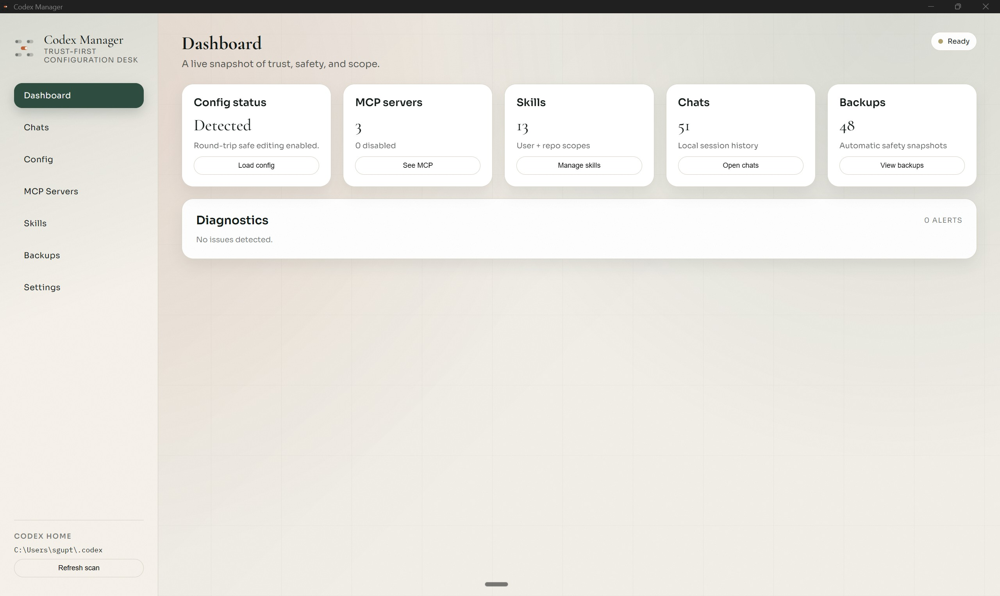

# Codex Manager (Tauri)

Codex Manager is a desktop configuration and asset manager for OpenAI Codex.
It does not run Codex sessions or execute arbitrary commands. It edits and organizes on-disk
Codex files with a safety-first flow (diff preview, backups, atomic writes).



## Features
- Config editor with Simple (root scalars), Advanced (nested values), and raw TOML modes.
- Diff preview before every change (stacked/unified view), plus automatic backups and restore.
- Public Config Library with curated presets and apply previews.
- My Configs: save personal presets and apply them later.
- MCP Servers: toggle enabled state and add/update tables.
- Skills: browse user/repo scopes, edit SKILL.md and text files, create/delete skills.
- Public Skills (Clawdhub): search registry, preview SKILL.md/files, install via overlay/replace/sync.
- Diagnostics panel for parse errors and missing paths.
- Settings for CODEX_HOME and repo roots.

## Supported platforms
- Windows 10/11 (x64): NSIS + MSI installers.
- macOS 14+ (arm64 + x64): DMG + app bundle (unsigned; Gatekeeper will warn on first open).
- Linux (x64): AppImage + .deb + .rpm.

Release builds are produced via GitHub Actions; download installers from Releases.

## Installation (local development)

### Prerequisites
- Node.js 18+ (20+ recommended)
- Rust toolchain (stable) via rustup
- Tauri system dependencies (platform specific)
  - Windows: Visual Studio Build Tools (Desktop development with C++), WebView2
  - macOS: Xcode Command Line Tools
  - Linux: GTK/WebKit packages (see Tauri prerequisites)

Tauri prerequisites: https://v2.tauri.app/start/prerequisites/

### Install dependencies
```bash
npm install
```

For installing and using the app, download the installer from the GitHub Releases page.

## Local development

### Run the desktop app (Tauri)
```bash
npm run tauri dev
```

### Optional: run the frontend only
This is useful for UI iteration, but backend commands will not work.
```bash
npm run dev
```

### Build a release bundle
Use the bundle formats that match your OS:

Windows:
```bash
npm run tauri build -- --bundles nsis,msi
```

macOS:
```bash
npm run tauri build -- --bundles dmg,app
```

Linux:
```bash
npm run tauri build -- --bundles appimage,deb,rpm
```

Windows installers require NSIS + WiX.

### Tests
```bash
cargo test --manifest-path src-tauri/Cargo.toml
```
Includes:
- TOML patching (scalar edits + MCP toggle)
- Backup/restore round trip (text + binary)
- Path traversal protection
- Skills scan + folder categorization
- Public skill zip planning (overlay/replace/sync)

## Usage

### First run setup
1) Open Settings and set CODEX_HOME (or ensure the `CODEX_HOME` env var is set).
2) Add any repo roots that contain `.codex/skills` for repo-scoped skills.
3) Return to Dashboard and click "Refresh scan" if needed.

### What the app manages
Canonical sources of truth are on disk:
- `CODEX_HOME/config.toml`
- `CODEX_HOME/skills/**`
- `REPO_ROOT/.codex/skills/**`
- `CODEX_HOME/prompts/**`
- `CODEX_HOME/rules/*.rules`

### Editing flow
All writes follow the same safety rails:
1) Preview a diff.
2) Create a backup.
3) Atomic write.
4) Re-validate and show status.

### Common actions
- Dashboard: view health and diagnostics, load config quickly.
- Config: edit root scalar keys, advanced nested values, or raw TOML with diff preview.
- Public Config Library: apply curated public configs (diff + backup).
- My Configs: save your own presets (stored in app data) and apply them to config.
- MCP Servers: toggle enabled, add/update server tables.
- Skills: view user and repo skills, edit SKILL.md, create or delete skills.
- Public Skills (Clawdhub): browse/search the Clawdhub registry, preview SKILL.md and files, then install via overlay/replace/sync.
- Backups: review, restore, or delete snapshots.

### Managing public presets
Public presets live in `src/features/config/data/publicConfigs.ts`. Add new entries there to
ship more curated configs in the Public Config Library.

### My Configs storage
User-created presets are stored in the app data directory under `user-configs/`.

## Project structure
- `src-tauri/` Rust backend (file ops, diffing, backups, TOML patching)
- `src/` React frontend
  - `features/` feature-first UI modules
  - `components/` shared UI primitives
  - `layouts/` app shell + chrome
  - `store/` shared state + backend actions

## Notes
- Raw config editors and previews show full values; handle secrets with care.
- The app only runs a small allowlist of Codex CLI management commands (optional).
